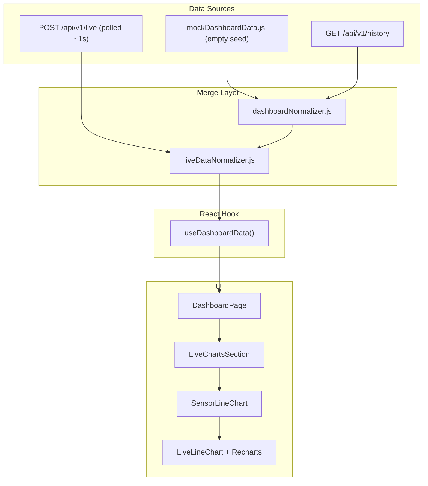
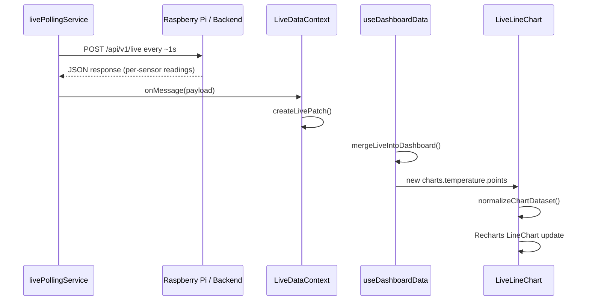
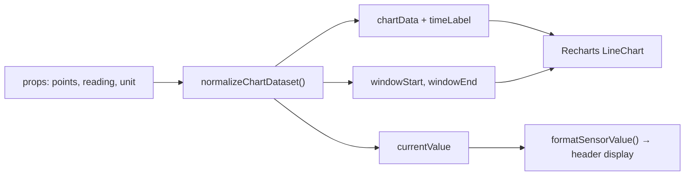

# Live Charts — Deep Dive

This document explains how the dashboard charts work end-to-end: where data comes from, how it is transformed, how it is rendered, and what your backend must send.

---

## Table of Contents

1. [Big Picture](#1-big-picture)
2. [Component Layers](#2-component-layers)
3. [The Data Model](#3-the-data-model)
4. [Data Flow (Mock → API → Live Polling)](#4-data-flow-mock--api--live-polling)
5. [Chart Utilities (`chartUtils.js`)](#5-chart-utilities-chartutilsjs)
6. [Live Data Merge (`liveDataNormalizer.js`)](#6-live-data-merge-livedatanormalizerjs)
7. [Rendering Engine (`LiveLineChart`)](#7-rendering-engine-livelinechart)
8. [The 60-Second Rolling Window](#8-the-60-second-rolling-window)
9. [Current Value Display](#9-current-value-display)
10. [Recharts Configuration Choices](#10-recharts-configuration-choices)
11. [Performance & UX Decisions](#11-performance--ux-decisions)
12. [Backend Contract](#12-backend-contract)
13. [File Map](#13-file-map)
14. [Common Issues & Debugging](#14-common-issues--debugging)

---

## 1. Big Picture

The dashboard shows **four live line charts**:

| Key           | Title         | Unit   | Color   |
|---------------|---------------|--------|---------|
| `temperature` | Temperature   | °C     | cyan    |
| `vibration`   | Vibration     | mm/s   | violet  |
| `sound`       | Sound           | dB     | green   |
| `current`     | Current         | mA (Amps × 1000) | amber   |

Each chart is a **time-series line chart** that keeps only the **last 60 seconds** of readings and auto-scrolls as new data arrives.



**Key idea:** charts never fetch data themselves. They receive a `charts` object from `useDashboardData()`, which merges mock/API history with the live data polled from `POST /api/v1/live`.

---

## 2. Component Layers

There are three UI layers. Each layer has one job.

### Layer 1 — `LiveChartsSection`

**File:** `src/components/dashboard/LiveChartsSection.jsx`

- Renders the section header ("Live Charts Section").
- Loops over `chartConfigs` (4 sensor types).
- Maps each config key to chart data: `charts.temperature`, `charts.vibration`, etc.
- Builds a **reading fallback** from `sensors` (used when chart points are empty).
- Wraps everything in an `ErrorBoundary`.

```jsx
chartConfigs.map((config) => (
  <SensorLineChart
    key={config.key}
    config={config}                    // icon + default color
    chartData={charts?.[config.key]}     // title, unit, color, points
    reading={readings[config.key]}       // fallback scalar from sensors
  />
))
```

### Layer 2 — `SensorLineChart`

**File:** `src/components/charts/SensorLineChart.jsx`

A thin adapter. It maps dashboard chart objects into `LiveLineChart` props:

| Dashboard field | LiveLineChart prop |
|-----------------|-------------------|
| `chartData.title` | `title` |
| `chartData.unit` | `unit` |
| `chartData.points` | `points` |
| `chartData.dataset` | `dataset` (alternate name) |
| `chartData.data` | `data` (legacy array of numbers) |
| `config.icon` | `icon` |
| `config.color` | `color` (if chart has no color) |
| `reading` | `reading` |

If `chartData` is missing, the chart is not rendered (`return null`).

### Layer 3 — `LiveLineChart`

**File:** `src/components/charts/LiveLineChart.jsx`

The actual chart UI:

- Card header with icon, title, and **current reading**
- Recharts `LineChart` inside a fixed-height container
- Loading skeleton, empty state, or live line
- Custom tooltip on hover

This is the only file that imports Recharts.

---

## 3. The Data Model

### Chart object shape

Each entry in `data.charts` looks like this:

```js
{
  title: 'Temperature',
  unit: '°C',
  color: '#0891b2',          // optional — falls back to chartConfig
  points: [                  // preferred format
    { timestamp: 1751558400000, value: 68 },
    { timestamp: 1751558401000, value: 67 },
    // ...
  ],
}
```

### Point shape

Every point **must** have:

```ts
{
  timestamp: number,  // Unix ms (Date.now() style)
  value: number,      // sensor reading as a number
}
```

Recharts reads `value` for the Y axis and `timestamp` for the X axis.

### Alternate formats (supported but secondary)

| Field     | Format | Used when |
|-----------|--------|-----------|
| `points`  | `[{ timestamp, value }]` | Primary — mock data, history API, live merge |
| `dataset` | Same as `points` | Alias accepted by `LiveLineChart` |
| `data`    | `[54, 57, 61, ...]` | Legacy — converted to points with 1-second spacing |

---

## 4. Data Flow (Mock → API → Live Polling)

### Step 1 — Initial state (mock, empty)

**File:** `src/data/mockDashboardData.js`

On first load the charts hold only metadata and **no seed points** — nothing is drawn until live data arrives:

```js
charts: {
  temperature: {
    title: 'Temperature',
    unit: '°C',
    color: '#0891b2',
    points: [],
  },
  // vibration, sound, current ...
}
```

Sensor `value`s also start as `null`, so headers show `--` until the first live response.

### Step 2 — REST API overlay

**File:** `src/services/dashboardNormalizer.js`

When the backend responds, history can replace mock charts:

```js
charts: historyPayload.charts ?? fallbackData.charts
```

Expected history response shape:

```json
{
  "charts": {
    "temperature": {
      "title": "Temperature",
      "unit": "°C",
      "points": [
        { "timestamp": 1751558400000, "value": 68 }
      ]
    }
  }
}
```

### Step 3 — Live polling updates

**Files:**

- `src/services/livePollingService.js` — polls `POST /api/v1/live` on an interval, re-broadcasts each response
- `src/context/LiveDataContext.jsx` — starts polling, stores `livePatch`
- `src/services/liveDataNormalizer.js` — merges live values into charts
- `src/hooks/useDashboardData.js` — combines API + live into final `data`

Every poll response updates `livePatch`. Then `mergeLiveIntoDashboard()` appends new points to each chart series.

### Step 4 — React re-render

`useDashboardData()` returns `data.charts`. When `livePatch` changes:

1. New points are merged in `mergeChartSeries()`
2. `DashboardPage` passes `data.charts` to `LiveChartsSection`
3. Each `LiveLineChart` re-normalizes points and Recharts redraws



---

## 5. Chart Utilities (`chartUtils.js`)

**File:** `src/lib/chartUtils.js`

This is the brain of the chart data logic. All time-window and point merging happens here.

### Constants

```js
CHART_WINDOW_SECONDS = 60
CHART_WINDOW_MS = 60000
```

Every chart shows at most **60 seconds** of data.

### `createSeedPoints(values, endTime)`

Converts a plain number array into timestamped points:

```js
// Input:  [54, 57, 61], endTime = 1000000
// Output: [
//   { timestamp: 999998000, value: 54 },
//   { timestamp: 999999000, value: 57 },
//   { timestamp: 1000000000, value: 61 },
// ]
```

Each value is spaced **1 second** apart, ending at `endTime`.

### `trimChartWindow(points, endTime)`

Filters points to the rolling window:

```js
windowStart = endTime - 60000
keep points where: windowStart <= timestamp <= endTime
then slice to last 60 points max
```

Old points fall off the left side automatically.

### `normalizeChartDataset(dataset, legacyData)`

Called inside `LiveLineChart` on every render (memoized).

**Priority:**

1. If `dataset` / `points` exists → trim to window
2. Else if `legacyData` / `data` exists → seed points then trim
3. Else → return `[]` (empty chart)

**Important fix for mock data:** if the last point is older than 60 seconds (static seed from page load), the window anchors to that last point instead of `Date.now()`. Otherwise seed data would disappear after 60 seconds on the page.

```js
const endTime = lastTimestamp < now - CHART_WINDOW_MS
  ? lastTimestamp   // historical seed — keep visible
  : now             // live stream — anchor to current time
```

### `appendChartPoint(points, value, timestamp)`

Adds one new point and trims:

```js
[...points, { timestamp, value: Number(value) }]
→ trimChartWindow(...)
```

Skips invalid values (`null`, `undefined`, non-finite numbers).

### `mergeChartPoints(existingPoints, incomingChart, scalarValue, timestamp)`

Used by live data merge. Priority:

1. **`incomingChart.points`** — replace/trim with full point array from backend
2. **`incomingChart.data`** — convert number array to points
3. **`scalarValue`** — append single reading (typical live-poll case)
4. Otherwise — keep `existingPoints`

Most live responses use option **3**: each poll returns one reading per sensor and the frontend appends one point per second.

### `getChartWindowDomain(points)`

Returns X-axis domain for Recharts:

```js
[end - 60000, end]
```

`end` = timestamp of the last point, or `Date.now()` if empty.

### `formatChartTime(timestamp)`

Formats axis labels and tooltip time as `HH:MM:SS` (locale-aware).

---

## 6. Live Data Merge (`liveDataNormalizer.js`)

**File:** `src/services/liveDataNormalizer.js`

### Incoming live payload

The primary format returns **each sensor as its own `{ timestamp, value }` object**, one response per poll (~1s):

```js
{
  temperature: { timestamp: 1751558400000, value: 68 },
  vibration:   { timestamp: 1751558400000, value: 3.4 },
  sound:       { timestamp: 1751558400000, value: 72 },
  current:     { timestamp: 1751558400000, value: 11.8 },
  prediction: { ... },      // optional — updates prediction section
  charts: { ... },          // optional — full chart objects
}
```

Each sensor's `timestamp` is **Unix epoch milliseconds** and is used as the X value for that sensor's next chart point. `readSensor()` also accepts ISO strings and epoch seconds defensively.

`createLivePatch()` keeps one persistent reading object per sensor (`temperature`, `vibration`, `sound`, `current`). When a response omits a sensor, the previous reading is carried forward. A chart point is appended only when the incoming `timestamp` is newer than the last point (see `appendChartPoint` dedup), so "one poll per second" cleanly maps to "one new point per second".

**Back-compat — flat scalars with a shared timestamp** are still accepted:

```js
{
  temperature: 68,
  vibration: 3.4,
  sound: 72,
  current: 11.8,
  timestamp: "2026-07-03T16:00:00Z",
}
```

Fields can also be nested under `data`:

```js
{ "data": { "temperature": { "timestamp": 1751558400000, "value": 68 }, ... } }
```

### `mergeChartSeries(existingChart, incomingChart, scalarValue, unit, timestamp)`

For each sensor key, builds the next chart object:

```js
{
  ...existingChart,
  ...(incomingChart ?? {}),
  unit: incomingChart?.unit ?? existingChart?.unit ?? unit,
  points: mergeChartPoints(existingPoints, incomingChart, scalarValue, timestamp),
}
```

**Example — 3 live polls for temperature (charts start empty):**

| Poll  | `temperature` | Resulting `points` length |
|-------|-----------------|---------------------------|
| t=0   | 66              | 1                         |
| t=1s  | 67              | 2                         |
| t=2s  | 68              | 3                         |

Points keep accumulating until the 60-second window fills, after which the oldest points are trimmed away.

### Sensor list update (for chart reading fallback)

Even though sensor **cards** were removed from the UI, `sensors` data still exists internally. Live responses update it via `updateSensorList()`. `LiveChartsSection` reads these values as a **fallback** when chart points are empty.

---

## 7. Rendering Engine (`LiveLineChart`)

### Render pipeline



### States

| Condition | What user sees |
|-----------|----------------|
| `isLoading === true` | Animated skeleton bars |
| `chartData.length === 0` | Connection-aware waiting state (see `ChartWaitingState`): "Waiting for live connection", "Connecting…", "Reconnecting…", or "Waiting for sensor data" |
| Has points | Live line chart |

### Y-axis domain (auto-scale)

```js
min = Math.min(...values)
max = Math.max(...values)
padding = (max - min || 1) * 0.15
domain = [min - padding, max + padding]
```

The line always fills the vertical space with 15% padding above and below.

### X-axis (time)

- Type: `number` (Unix ms)
- Domain: fixed 60-second window from `getChartWindowDomain()`
- `allowDataOverflow` — points outside domain are clipped, window slides forward

---

## 8. The 60-Second Rolling Window

Visual mental model:

```
Timeline ──────────────────────────────────────────────►

|<────────────── 60 seconds ──────────────>|
 windowStart                            windowEnd (now)

  ●──●──●──●──●──●──●──●──●──●──●──●──●  ← visible line
  ↑                                    ↑
  dropped                            newest point
  (too old)
```

When a new point arrives:

1. Append to array
2. Remove points older than `windowEnd - 60s`
3. Cap at 60 points maximum
4. X-axis domain shifts right → **auto-scroll effect**

No manual scroll code is needed. Recharts domain + new data creates the scrolling illusion.

---

## 9. Current Value Display

The large number under the chart title (e.g. `68°C`) comes from:

```js
const currentValue = normalizedDataset.length
  ? normalizedDataset[normalizedDataset.length - 1].value  // last point in chart
  : reading ?? null                                         // fallback from sensors
```

| Source | When used |
|--------|-----------|
| Last chart point | Normal case — chart has data |
| `reading` from sensors | Chart empty but sensor value exists |
| `--` | Both missing — `formatSensorValue()` returns dash |

`formatSensorValue()` rules (`src/lib/formatSensorValue.js`):

- `68` + `°C` → `68°C` (no space before degree symbol)
- `3.4` + `mm/s` → `3.4 mm/s` (space before other units)
- null/empty → `--`

---

## 10. Recharts Configuration Choices

### `isAnimationActive={false}`

Line animation is **disabled** on purpose. With live data updating every second, animation would cause flicker and CPU waste.

### `type="monotone"`

Smooth curves between points instead of sharp angles. Good for sensor trends.

### `dot={false}`

Hides dots on every point — cleaner for dense live data. Hover shows `activeDot` instead.

### `ResponsiveContainer`

Chart fills 100% of parent height (`h-60` / `h-64`). Resizes with layout.

### Custom `ChartTooltip`

Shows formatted time + value with unit on hover. Uses the same `formatSensorValue()` as the header.

---

## 11. Performance & UX Decisions

| Decision | Why |
|----------|-----|
| Lazy load `LiveChartsSection` | Recharts is ~350KB — loaded only when dashboard renders |
| `React.memo` on chart components | Avoid re-render when unrelated dashboard data changes |
| `useMemo` for dataset normalization | Expensive array ops only when points change |
| Code split via `React.lazy` + `Suspense` | Shows `ChartSkeleton` while chunk loads |
| `AnimatedValue` with reduced-motion fallback | Accessible number transitions in header |
| Error boundary around chart grid | One chart crash does not break the whole dashboard |

---

## 12. Backend Contract

### Live endpoint — `POST /api/v1/live`

The frontend polls this endpoint once per second (configurable). The request body is an empty JSON object `{}` by default. Respond with each sensor carrying its **own** timestamp (Unix epoch ms) and value:

```json
{
  "temperature": { "timestamp": 1751558400000, "value": 68.2 },
  "vibration":   { "timestamp": 1751558400000, "value": 3.4 },
  "sound":       { "timestamp": 1751558400000, "value": 72.1 },
  "current":     { "timestamp": 1751558400000, "value": 11.8 }
}
```

The frontend will:

1. Append one point per sensor per response, using **that sensor's own timestamp** as the X value
2. Skip the append if the timestamp is not newer than the sensor's last point (dedup)
3. Trim to the 60-second window
4. Update `lastUpdate` in the hero banner (latest of the four sensor timestamps)
5. Update sensor values used as reading fallback

> Legacy flat scalars (`"temperature": 68.2` + a single top-level `"timestamp"`) are still accepted for back-compat.

> **Transport:** live data is fetched by interval polling of `POST /api/v1/live`. The poll interval is controlled by `VITE_LIVE_POLL_INTERVAL` (ms). Connection status is derived from request success/failure: first success → `connected`, a failure after connecting → `reconnecting`.

### Optional — send full chart history

If your backend buffers history:

```json
{
  "charts": {
    "temperature": {
      "points": [
        { "timestamp": 1751558400000, "value": 68 },
        { "timestamp": 1751558401000, "value": 69 }
      ]
    }
  },
  "timestamp": "2026-07-03T16:00:01Z"
}
```

This **replaces** the visible window with your provided points (after trim).

### REST history endpoint

`GET /api/v1/history` should return the same `charts` structure for the initial page load before the first live poll returns.

### Environment variables

```env
VITE_API_BASE_URL=/api/v1
VITE_API_PROXY_TARGET=http://localhost:8000
# Interval (ms) between live POST /live polls. Defaults to 1000 (once per second).
VITE_LIVE_POLL_INTERVAL=1000
```

Requests go through `VITE_API_BASE_URL` (proxied to `VITE_API_PROXY_TARGET` in dev). Lower `VITE_LIVE_POLL_INTERVAL` for faster charts, raise it to reduce backend load.

---

## 13. File Map

```
src/
├── pages/DashboardPage.jsx          # passes data.charts + data.sensors to section
├── components/
│   ├── dashboard/LiveChartsSection.jsx   # 4-chart grid + reading map
│   └── charts/
│       ├── SensorLineChart.jsx           # prop adapter
│       └── LiveLineChart.jsx             # Recharts + UI
├── constants/chartConfig.js         # keys, icons, default colors
├── lib/
│   ├── chartUtils.js                # window, merge, seed, format time
│   └── formatSensorValue.js         # "68°C" display formatting
├── data/mockDashboardData.js        # chart metadata (empty points, no seed)
├── services/
│   ├── dashboardNormalizer.js       # REST + live → final data
│   ├── liveDataNormalizer.js        # live payload → chart point merge
│   └── livePollingService.js        # polls POST /live, re-broadcasts responses
├── api/endpoints.js                 # endpoint paths + getLivePollInterval()
├── context/LiveDataContext.jsx      # starts polling + stores livePatch
└── hooks/useDashboardData.js        # single hook consumed by App
```

---

## 14. Common Issues & Debugging

### Chart shows empty / stuck on "Waiting for..."

**Check:**

1. Is `POST /api/v1/live` returning 200 with numeric fields? (`value`, not `"N/A"`)
2. Is each sensor `timestamp` valid (epoch ms)?
3. Open the Network tab — is `POST /live` firing every ~1s and succeeding?
4. Open React DevTools → `data.charts.temperature.points` — is the array growing?

### Header shows `--` but line is visible

Unlikely if points exist — header uses last point value. If you see `--`, `normalizeChartDataset()` returned empty. Check prop name: must be `points`, not `values`.

### Chart flickers on every update

Should not happen — `isAnimationActive={false}`. If flicker persists, check for unnecessary remounting (changing `key` on chart component).

### Line flat / Y-axis wrong

All values identical → padding uses `(max - min || 1) * 0.15`, so flat line still renders.

### How to test without backend

Charts now start **empty** (no seed points) and display a "Waiting for live connection" state until the first successful poll. Run:

```bash
npm run dev
```

With no backend, `POST /api/v1/live` will fail and the charts stay in the waiting/reconnecting state — that is expected.

### How to test live updates without Raspberry Pi

Stand up a tiny FastAPI endpoint that returns the per-sensor DTO:

```python
from fastapi import FastAPI
import time

app = FastAPI()

@app.post("/api/v1/live")
def live():
    now = int(time.time() * 1000)
    return {
        "temperature": {"timestamp": now, "value": 68.2},
        "vibration":   {"timestamp": now, "value": 3.4},
        "sound":       {"timestamp": now, "value": 72.1},
        "current":     {"timestamp": now, "value": 11.8},
    }
```

Or temporarily log in `LiveDataContext`:

```js
service.onMessage((payload) => {
  console.log('[live]', payload)
  setLivePatch((previous) => createLivePatch(previous, payload))
})
```

---

## Quick Reference — One Live Tick

```
POST /api/v1/live response: { temperature: { timestamp: 1751558400000, value: 68 }, ... }
        ↓
createLivePatch() stores per-sensor { value, timestamp } objects
        ↓
mergeLiveIntoDashboard()
        ↓
mergeChartSeries() → appendChartPoint(existing, 68, sensorTimestamp)
        ↓
appendChartPoint() dedups if timestamp <= last point, else appends
        ↓
trimChartWindow() keeps last 60s
        ↓
useDashboardData() → data.charts.temperature.points updated
        ↓
LiveLineChart re-renders
        ↓
normalizeChartDataset() → chartData
        ↓
Recharts draws line + header shows "68°C"
```

---

## Summary

| Concept | Implementation |
|---------|----------------|
| Chart library | Recharts (`LineChart`) |
| Time window | 60 seconds rolling |
| Point format | `{ timestamp: ms, value: number }` |
| Live updates | Per-sensor `{ timestamp, value }` appended per poll of `POST /live` |
| Initial data | Empty charts + `GET /history` overlay |
| Display value | Last point, or sensor fallback |
| Main merge logic | `chartUtils.js` + `liveDataNormalizer.js` |
| UI entry point | `LiveChartsSection` → `SensorLineChart` → `LiveLineChart` |

If you extend the project (add a 5th sensor, change window to 5 minutes, etc.), start with `chartConfig.js` and mirror the same pattern in `liveDataNormalizer.js` and `mockDashboardData.js`.
