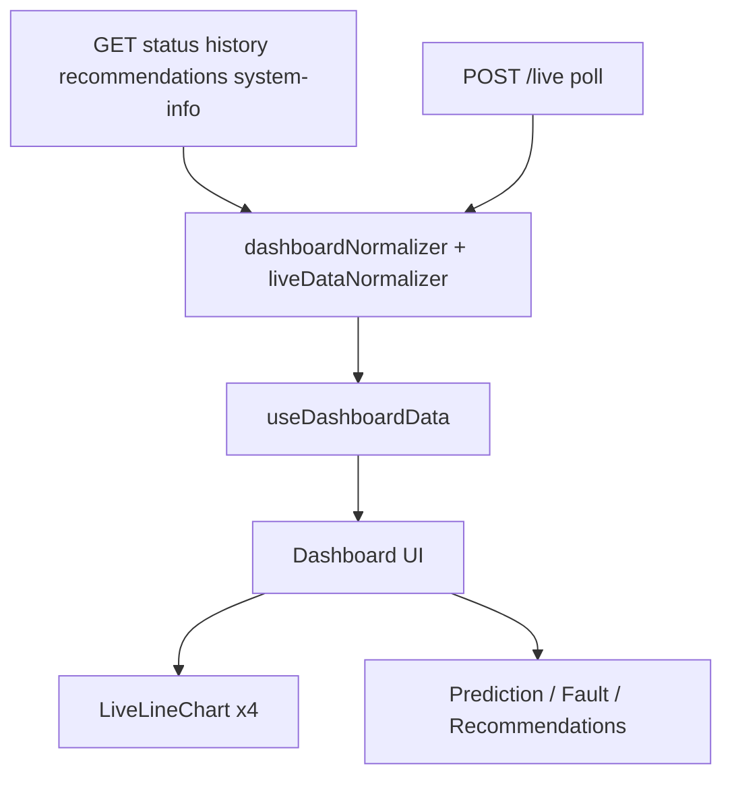

# Predictive Maintenance — Project Documentation

Complete documentation for the **Industrial Motor Predictive Maintenance** graduation project dashboard.

| Item | Details |
|------|---------|
| Project name | Motor Predictive Maintenance Dashboard |
| Production URL | https://mostafa.maksoudaa.com |
| API base | https://mostafa.maksoudaa.com/api/v1 |
| Repository | https://github.com/mostafayman14/predictive-maintenance-2 |
| VPS IP | `217.65.144.196` (Hostinger) |

Related docs:

- [API.md](./API.md) — full backend API contract for developers
- [CHARTS.md](./CHARTS.md) — live charts deep dive

---

## Table of contents

1. [What this project is](#1-what-this-project-is)
2. [Features](#2-features)
3. [Tech stack](#3-tech-stack)
4. [Architecture](#4-architecture)
5. [Project structure](#5-project-structure)
6. [Data flow](#6-data-flow)
7. [Sensors & charts](#7-sensors--charts)
8. [API overview](#8-api-overview)
9. [Frontend layers](#9-frontend-layers)
10. [Backend](#10-backend)
11. [Environment variables](#11-environment-variables)
12. [Local development](#12-local-development)
13. [Production deployment](#13-production-deployment)
14. [Testing](#14-testing)
15. [Troubleshooting](#15-troubleshooting)

---

## 1. What this project is

A React web dashboard that monitors an industrial motor using sensor readings and predictive maintenance model outputs.

It displays:

- Live temperature, vibration, sound, and current charts
- Motor prediction (e.g. Normal Operation)
- Fault / severity status
- Maintenance recommendations
- Connection / last-update status

The UI is designed for a graduation / demo workflow: frontend talks to a FastAPI backend (mock or real Raspberry Pi / ML service) over REST + interval polling.

---

## 2. Features

| Feature | Description |
|---------|-------------|
| Live charts | Four Recharts line charts, 60-second rolling window |
| Live polling | Optional `POST /live` every ~1s (`VITE_LIVE_POLLING_ENABLED`) |
| Prediction card | Model label + probability |
| Fault card | Diagnostic fault text + severity badge |
| Recommendations | Accordion list of maintenance tips |
| Offline banner | Shows when the browser goes offline |
| API error panel | Loading / retry UI when REST endpoints fail |
| Mock fallback | Dashboard still renders labels/structure if APIs fail |
| Responsive layout | Sidebar + navbar, mobile-friendly |
| Production deploy | Apache reverse proxy + systemd FastAPI service |

---

## 3. Tech stack

### Frontend

| Tool | Role |
|------|------|
| React 19 | UI |
| Vite 8 | Build / dev server |
| Tailwind CSS 4 | Styling |
| Framer Motion | Animations |
| Recharts | Live line charts |
| Axios | HTTP client |
| Lucide React | Icons |
| Radix Accordion | Recommendation accordion |
| Oxlint | Linting |

### Backend

| Tool | Role |
|------|------|
| Python 3 / FastAPI | REST API |
| Uvicorn / Gunicorn | ASGI server |
| CORS middleware | Local / cross-origin access |

### Production hosting

| Tool | Role |
|------|------|
| Hostinger VPS (Ubuntu) | Server |
| Apache 2 | Static frontend + `/api` reverse proxy |
| systemd | Keeps FastAPI running |
| Let's Encrypt / Certbot | HTTPS for `mostafa.maksoudaa.com` |

---

## 4. Architecture

```text
Browser
  │
  ▼
Apache (mostafa.maksoudaa.com :80/:443)
  ├── /           → React static build (dist/)
  └── /api/       → proxy → 127.0.0.1:8010 (FastAPI)

Local development:
  Vite (:5173) proxies /api → localhost:8000 (uvicorn)
```



---

## 5. Project structure

```text
predictive-maintenance-2/
├── backend/
│   ├── main.py              # FastAPI app (status, history, recommendations, system-info, live)
│   └── requirements.txt     # fastapi, uvicorn
├── deploy/
│   └── deploy.sh            # Git pull + build + systemd + Apache on VPS
├── docs/
│   ├── API.md               # API contract for backend team
│   ├── CHARTS.md            # Chart system deep dive
│   └── PROJECT.md           # This file
├── public/
├── src/
│   ├── api/
│   │   ├── client.js        # Axios instance, retries, error messages
│   │   └── endpoints.js     # Paths + live polling helpers
│   ├── components/
│   │   ├── cards/           # Overview, health, confidence, status badge
│   │   ├── charts/          # SensorLineChart, LiveLineChart
│   │   ├── common/          # Skeleton, empty state, error boundary, offline banner
│   │   ├── dashboard/       # LiveChartsSection, ApiStatePanel, HeroBanner, PredictionSection
│   │   ├── layout/          # Sidebar, Navbar, DashboardLayout
│   │   ├── prediction/      # PredictionCard, FaultCard, RecommendationAccordion
│   │   ├── system/          # SystemInfoCard, ConnectionStatusCard
│   │   └── ui/              # Button, card, badge, accordion, skeleton, motion wrappers
│   ├── constants/
│   │   ├── chartConfig.js   # Sensor keys, colors, icons
│   │   └── dashboardIcons.js
│   ├── context/
│   │   └── LiveDataContext.jsx  # Starts/stops live polling
│   ├── data/
│   │   └── mockDashboardData.js # Label/structure fallbacks
│   ├── hooks/
│   │   ├── useApiResource.js
│   │   ├── useDashboardApi.js
│   │   ├── useDashboardData.js  # Main merge hook used by App
│   │   ├── useLiveData.js
│   │   ├── useClock.js
│   │   ├── useOnlineStatus.js
│   │   └── usePrefersReducedMotion.js
│   ├── lib/
│   │   ├── chartUtils.js        # 60s window, append/dedup points
│   │   ├── formatSensorValue.js
│   │   ├── formatTime.js
│   │   ├── motion.js
│   │   └── utils.js
│   ├── pages/
│   │   └── DashboardPage.jsx
│   ├── services/
│   │   ├── dashboardService.js
│   │   ├── dashboardNormalizer.js
│   │   ├── liveDataNormalizer.js
│   │   └── livePollingService.js
│   ├── App.jsx
│   ├── main.jsx
│   └── index.css
├── .env                     # Local env (not committed)
├── .env.example
├── package.json
├── vite.config.js
└── README.md
```

---

## 6. Data flow

### On page load

1. `App` wraps content in `LiveDataProvider`.
2. `useDashboardData()` calls four GET endpoints in parallel:
   - `/status`
   - `/history`
   - `/recommendations`
   - `/system-info`
3. Responses are merged with mock fallbacks in `dashboardNormalizer.js`.
4. If live polling is enabled, `LiveDataContext` starts polling `POST /live`.

### Live updates

1. `LivePollingService` POSTs `{}` to `/live` every `VITE_LIVE_POLL_INTERVAL` ms.
2. `createLivePatch()` normalizes per-sensor `{ timestamp, value }`.
3. `mergeLiveIntoDashboard()` updates charts, sensors, prediction, health, confidence.
4. Charts append one point per sensor (dedup by timestamp) and keep last 60 seconds.
5. Navbar connection badge maps poll status → Connected / Connecting / Reconnecting.

Mock / static UI labels (brand, hero copy, navigation) always come from `mockDashboardData.js`.

---

## 7. Sensors & charts

| Key | Title | Unit | Default color |
|-----|-------|------|---------------|
| `temperature` | Temperature | °C | `#0891b2` |
| `vibration` | Vibration | mm/s | `#7c3aed` |
| `sound` | Sound | dB | `#059669` |
| `current` | Current | A | `#d97706` |

### Point contract

```json
{ "timestamp": 1751558400000, "value": 68.2 }
```

- `timestamp` — Unix **milliseconds**
- `value` — numeric only (strings like `"N/A"` are ignored)

### Chart behavior

| Rule | Value |
|------|-------|
| Rolling window | 60 seconds |
| Max points | 60 per chart |
| Live transport | Polling `POST /live` (not WebSocket) |
| Dedup | Skip if new timestamp ≤ last point |
| Animation | Disabled on line (avoids flicker) |

More detail: [CHARTS.md](./CHARTS.md).

---

## 8. API overview

| Method | Path | Purpose |
|--------|------|---------|
| `GET` | `/api/v1/status` | Sensors, prediction, fault |
| `GET` | `/api/v1/history` | Initial chart points |
| `GET` | `/api/v1/recommendations` | Maintenance tips (+ optional fault) |
| `GET` | `/api/v1/system-info` | Device / firmware metadata |
| `POST` | `/api/v1/live` | Live sensor tick |
| `DELETE` | `/api/v1/live` | Clear manual mock readings (dev backend only) |

### Live response (recommended minimum)

```json
{
  "temperature": { "timestamp": 1751558400000, "value": 68.2 },
  "vibration":   { "timestamp": 1751558400000, "value": 3.4 },
  "sound":       { "timestamp": 1751558400000, "value": 72.1 },
  "current":     { "timestamp": 1751558400000, "value": 11.8 }
}
```

Full request/response schemas, curl examples, and MVP order: [API.md](./API.md).

**Auth:** none currently.

**Retries:** GET up to 2 times on `429` / `5xx` / network fail. POST `/live` does not retry.

---

## 9. Frontend layers

| Layer | Files | Job |
|-------|-------|-----|
| App shell | `App.jsx`, layout, navbar, sidebar | Chrome + offline banner |
| Page | `DashboardPage.jsx` | Hero, charts, prediction section |
| Data hook | `useDashboardData.js` | Merge REST + live + mock |
| API | `dashboardService.js`, `client.js` | HTTP calls |
| Live | `LiveDataContext`, `livePollingService` | Poll `/live` |
| Normalize | `dashboardNormalizer`, `liveDataNormalizer` | Shape API → UI props |
| Charts | `LiveChartsSection` → `SensorLineChart` → `LiveLineChart` | Render time series |

UI sections currently rendered on the main dashboard:

1. API loading / error panel
2. Hero banner + last update time
3. Four live charts
4. Prediction, fault, recommendations

Some normalized fields (`overview`, `healthScore`, `confidence`, `systemInfo`) are supported by the merge layer but not shown in the main layout yet.

---

## 10. Backend

Path: `backend/main.py`

### What it provides for demos

| Endpoint | Behavior |
|----------|----------|
| `/status` | Simulated sensors + fixed prediction/fault |
| `/history` | 60 seconds of simulated chart points |
| `/recommendations` | Static tip list |
| `/system-info` | Mock Raspberry Pi metadata |
| `/live` with `{}` | Simulated sine-wave readings |
| `/live` with body | Accepts real sensor values and caches them |
| `DELETE /live` | Clears cached manual readings |

Production Raspberry Pi / ML services should implement the same URL contract; they do not need the DELETE helper.

### Run locally

```bash
cd backend
python3 -m venv .venv
source .venv/bin/activate
pip install -r requirements.txt
uvicorn main:app --host 0.0.0.0 --port 8000
```

OpenAPI UI: http://localhost:8000/docs

---

## 11. Environment variables

| Variable | Default | Description |
|----------|---------|-------------|
| `VITE_API_BASE_URL` | `/api/v1` | Axios base URL |
| `VITE_API_PROXY_TARGET` | `http://localhost:8000` | Vite dev proxy target |
| `VITE_LIVE_POLLING_ENABLED` | `false` | Must be `"true"` to poll `/live` |
| `VITE_LIVE_POLL_INTERVAL` | `1000` | Poll interval in ms |

Example local `.env`:

```env
VITE_API_BASE_URL=/api/v1
VITE_API_PROXY_TARGET=http://localhost:8000
VITE_LIVE_POLLING_ENABLED=true
VITE_LIVE_POLL_INTERVAL=1000
```

Restart `npm run dev` after changing `.env`.

Production build uses values written by `deploy/deploy.sh` into `.env.production` on the VPS.

---

## 12. Local development

### Prerequisites

- Node.js 18+ (20 recommended)
- Python 3.10+
- npm

### Terminal 1 — backend

```bash
cd backend
python3 -m venv .venv
source .venv/bin/activate   # Windows: .venv\Scripts\activate
pip install -r requirements.txt
uvicorn main:app --host 0.0.0.0 --port 8000
```

### Terminal 2 — frontend

```bash
npm install
cp .env.example .env   # then set VITE_LIVE_POLLING_ENABLED=true if needed
npm run dev
```

Open http://localhost:5173  

Vite proxies `/api/*` → `VITE_API_PROXY_TARGET`.

### Useful scripts

| Command | Purpose |
|---------|---------|
| `npm run dev` | Dev server |
| `npm run build` | Production build → `dist/` |
| `npm run preview` | Preview production build |
| `npm run lint` | Oxlint |

---

## 13. Production deployment

### Current production layout

| Piece | Location / value |
|-------|------------------|
| Domain | https://mostafa.maksoudaa.com |
| App dir | `/var/www/predictive-maintenance-2` |
| Frontend | Apache `DocumentRoot` → `dist/` |
| Backend | Gunicorn + Uvicorn workers on `127.0.0.1:8010` |
| systemd unit | `predictive-api.service` |
| Deploy script | `deploy/deploy.sh` |
| HTTPS | Let's Encrypt for `mostafa.maksoudaa.com` |

### How traffic works

```text
https://mostafa.maksoudaa.com/          → React SPA
https://mostafa.maksoudaa.com/api/...   → Apache proxy → FastAPI :8010
```

Port `8010` is **internal only**. Do not expose it publicly.

### Redeploy from GitHub (on VPS)

```bash
ssh root@YOUR_VPS_IP
bash /var/www/predictive-maintenance-2/deploy/deploy.sh
```

The script:

1. `git pull` (or clones repo)
2. Creates/updates Python venv and installs deps + gunicorn
3. Writes production env, runs `npm install` + `npm run build`
4. Restarts `predictive-api` systemd service
5. Ensures Apache site for `mostafa.maksoudaa.com` + `/api` proxy

### Important GitHub note

Deploy expects `https://github.com/mostafayman14/predictive-maintenance-2.git`.  
Local changes must be pushed to that remote before VPS `git pull` picks them up.

### Service commands (on VPS)

```bash
systemctl status predictive-api
systemctl restart predictive-api
journalctl -u predictive-api -f
apache2ctl configtest && systemctl reload apache2
```

---

## 14. Testing

### Browser

1. Open https://mostafa.maksoudaa.com (or local Vite URL).
2. Confirm Network tab:
   - Four GET requests on load
   - `POST /api/v1/live` every ~1s when polling is enabled
3. Charts should fill; connection badge should become **Live Connected**.

### curl

```bash
BASE=https://mostafa.maksoudaa.com/api/v1

curl -s "$BASE/status" | jq
curl -s "$BASE/history" | jq
curl -s "$BASE/recommendations" | jq
curl -s "$BASE/system-info" | jq
curl -s -X POST "$BASE/live" -H "Content-Type: application/json" -d '{}' | jq
```

### Push real sensor samples (dev / Pi)

```bash
NOW=$(python3 -c "import time; print(int(time.time()*1000))")

curl -s -X POST "$BASE/live" \
  -H "Content-Type: application/json" \
  -d "{
    \"temperature\": {\"timestamp\": $NOW, \"value\": 72.5},
    \"vibration\":   {\"timestamp\": $NOW, \"value\": 3.8},
    \"sound\":       {\"timestamp\": $NOW, \"value\": 74.0},
    \"current\":     {\"timestamp\": $NOW, \"value\": 12.1}
  }" | jq
```

---

## 15. Troubleshooting

| Problem | Likely cause | Fix |
|---------|--------------|-----|
| `ERR_CONNECTION_REFUSED` on `:8000` | Backend not running | Start `uvicorn` locally or check `predictive-api` on VPS |
| Charts say waiting | Live polling off or `/live` failing | Set `VITE_LIVE_POLLING_ENABLED=true`, restart frontend; verify `POST /live` returns numbers |
| Charts empty after poll | Non-numeric values / bad timestamps | Use Unix **ms** and numeric `value` |
| Blank SPA on domain | Wrong Apache DocumentRoot / missing `dist` | Rebuild with `deploy.sh`; confirm `dist/index.html` |
| API 502 on domain | FastAPI down | `systemctl restart predictive-api` |
| Directory listing on domain | Wrong VirtualHost / old DocumentRoot | Ensure site uses `ServerName mostafa.maksoudaa.com` and `dist/` |
| Poll loop unwanted | Polling enabled | Set `VITE_LIVE_POLLING_ENABLED=false` and rebuild/restart |
| Git deploy not updated | Changes not pushed | Push to `mostafayman14/predictive-maintenance-2` then rerun `deploy.sh` |

---

## Team handoff checklist

- [ ] Backend implements the five primary endpoints from [API.md](./API.md)
- [ ] `POST /live` returns per-sensor `{ timestamp, value }` in milliseconds
- [ ] Frontend `.env` has correct base URL and live polling flag
- [ ] Local: Vite + FastAPI both running
- [ ] Production: Apache proxy + systemd service healthy
- [ ] Latest code pushed to GitHub before VPS `git pull` / `deploy.sh`
- [ ] HTTPS certificate auto-renewed by Certbot

---

## Summary

This project is a **React + Vite dashboard** backed by a **FastAPI `/api/v1` service**. Rest endpoints load snapshot state; live charts grow from polling `POST /live`. Production serves the SPA and proxies API traffic on **https://mostafa.maksoudaa.com**.

For day-to-day coding:

- UI / charts → `src/` + [CHARTS.md](./CHARTS.md)
- Backend contract → [API.md](./API.md)
- Ship to VPS → `deploy/deploy.sh`
